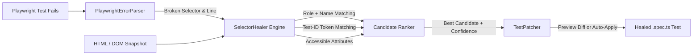

<div align="center">

# ✨ HealWright ✨

**Autonomous AI-Powered Self-Healing E2E Test & Selector Repair Engine**

[](https://github.com/bombordirocrocodildok-cmyk/healwright/actions)
[](https://opensource.org/licenses/MIT)
[](https://nodejs.org/)
[](https://www.typescriptlang.org/)
[](https://playwright.dev/)

*Stop wasting developer hours on brittle E2E test failures. Automatically diagnose broken selectors, compute resilient accessibility matches, and patch your test suites in place.*

</div>

---

## 💡 Why HealWright?

End-to-End (E2E) tests are the backbone of modern web applications, but they are notoriously brittle. A designer changes a CSS class, an engineer refactors a component ID, or a button gets wrapped in a modern design system component — and suddenly **dozens of CI tests break**.

**HealWright** solves this by turning failing test runs into self-healing cycles:

1. **Parses Failure Logs:** Automatically extracts failing test files, line numbers, and expired locators from Playwright traces.
2. **Inspects DOM Snapshots:** Analyzes the target DOM and accessibility tree at the exact failure moment.
3. **Multi-Strategy Healing:** Computes match candidates across:
   - **Accessible Roles & Names:** (`button`, `textbox`, `combobox` with accessible names)
   - **Modern Test IDs:** (`data-testid`, `data-cy`, `data-test`)
   - **Semantic Attributes:** (`aria-label`, `placeholder`, `name`)
   - **Fuzzy Token Matching:** Tolerant to partial renames and structural moves.
4. **Auto-Patches Test Files:** Generates unified diffs and can directly patch your `.spec.ts` or `.spec.js` files with Playwright-recommended best-practice locators (`page.getByRole(...)`, `page.getByTestId(...)`).
5. **AI Agent Ready:** Built as a native AI Agent Skill for Claude Code, Gemini, Antigravity, and Cursor.

---

## 🛠️ Architecture



---

## 🚀 Quickstart

### 1. Installation

```bash
# Clone the repository
git clone https://github.com/bombordirocrocodildok-cmyk/healwright.git
cd healwright

# Install dependencies and build
npm install
npm run build
```

Or install globally via npm (or link locally):
```bash
npm link
```

### 2. Try the Live Demo

Run the built-in demo to heal an example failing checkout test against a refactored HTML snapshot:

```bash
npm run demo
```

Output:
```text
━━━━━━━━━━━━━━━━━━━━━━━━━━━━━━━━━━━━━━━━━━━━━━━━━━━━━━━━━━━━
🎯 Target File:    examples/sample.spec.ts:7
❌ Old Selector:   #old-checkout-submit-btn
✅ Healed Locator: page.getByTestId('checkout-submit')
📊 Confidence:     55%
💡 Strategy:       test-id
📝 Reason:         Matching test-id token: "checkout-submit"

Proposed Diff:
--- examples/sample.spec.ts:7
+++ examples/sample.spec.ts:7
@@ -7,1 +7,1 @@
-   await page.locator('#old-checkout-submit-btn').click();
+   await page.getByTestId('checkout-submit').click();

ℹ️  Run with --apply to automatically update the test file.
━━━━━━━━━━━━━━━━━━━━━━━━━━━━━━━━━━━━━━━━━━━━━━━━━━━━━━━━━━━━
```

---

## 💻 CLI Usage

### Heal a Specific Broken Test Locator

```bash
# Dry run: preview proposed diff
healwright fix --test-file tests/checkout.spec.ts --line 42 --html snapshots/failure.html

# Auto-apply the fix to the test file in place
healwright fix --test-file tests/checkout.spec.ts --line 42 --html snapshots/failure.html --apply
```

### Scan a Playwright Failure Log

```bash
# Scan full Playwright run logs and heal all failed locators
healwright scan --log playwright-output.log --html snapshots/failure.html --apply
```

### Machine-Readable Output for AI Agents & CI

```bash
healwright fix -f tests/auth.spec.ts -l 15 --html snap.html --json
```

---

## 🤖 AI Agent Integration

HealWright includes an official `SKILL.md` ready for autonomous AI coding agents:
- **Claude Code**: Place `SKILL.md` in `.claude/skills/healwright/SKILL.md`
- **Antigravity / Gemini**: Loaded in `skills/healwright/SKILL.md`
- **Cursor / Windsurf**: Run via terminal or rule execution

When your AI agent runs Playwright and encounters a test failure, it autonomously triggers HealWright to repair the locator without human intervention.

---

## 📦 Programmatic API

You can embed HealWright directly into your test runner or custom reporters:

```typescript
import { healLocator, PlaywrightErrorParser } from 'healwright';

const report = healLocator(
  {
    originalSelector: '#old-submit-btn',
    locatorMethod: 'locator',
    filePath: 'tests/checkout.spec.ts',
    lineNumber: 24,
  },
  htmlSnapshotString,
  {
    minConfidence: 0.5,
    autoApply: true, // directly update file
  }
);

console.log(report.bestCandidate?.suggestedLocator);
// => page.getByRole('button', { name: 'Complete Order' })
```

---

## 🧪 Testing

Run the automated test suite powered by Node.js native test runner:

```bash
npm test
```

---

## 🗺️ Roadmap

- [x] Fast zero-dependency DOM element & attribute parser
- [x] Multi-strategy scoring (Accessible Role/Name, TestId, Fuzzy attributes)
- [x] Modern Playwright locator generator (`getByRole`, `getByTestId`, `getByLabel`)
- [x] Atomic test file patcher with unified diff preview
- [x] AI Agent Skill (`SKILL.md`) integration
- [ ] Visual AI validation (screenshot comparison before/after click)
- [ ] Playwright Custom Reporter integration (`@healwright/reporter`)
- [ ] Cypress & WebdriverIO locator syntax generator

---

## 📄 License

Distributed under the [MIT License](LICENSE). Free for individual, open-source, and enterprise commercial use.
